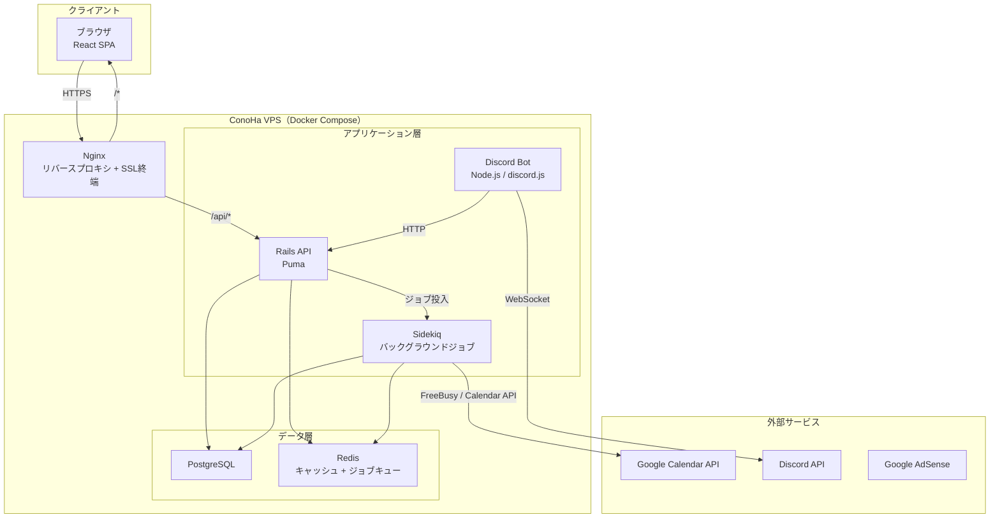
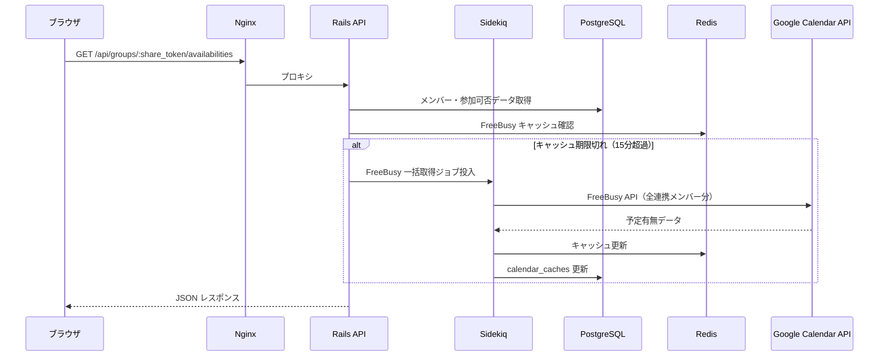
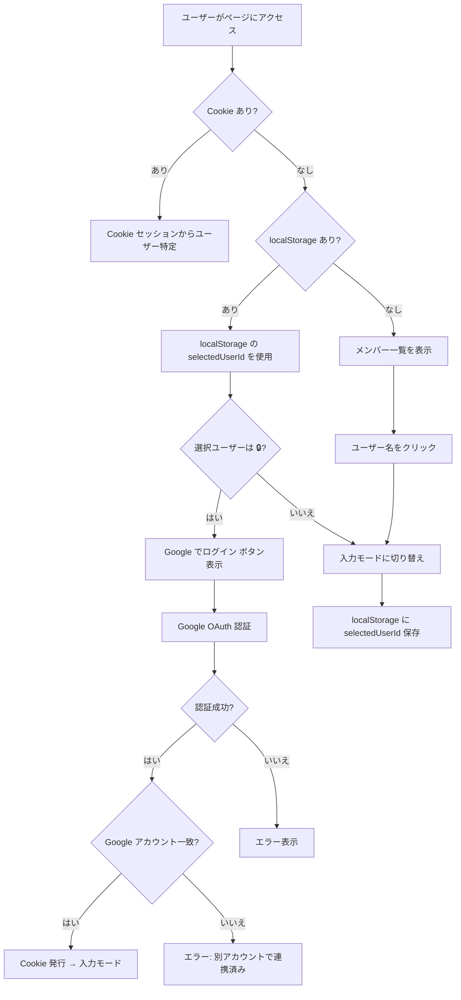
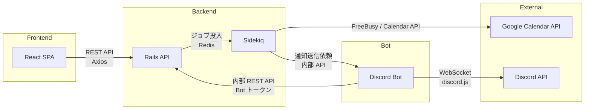
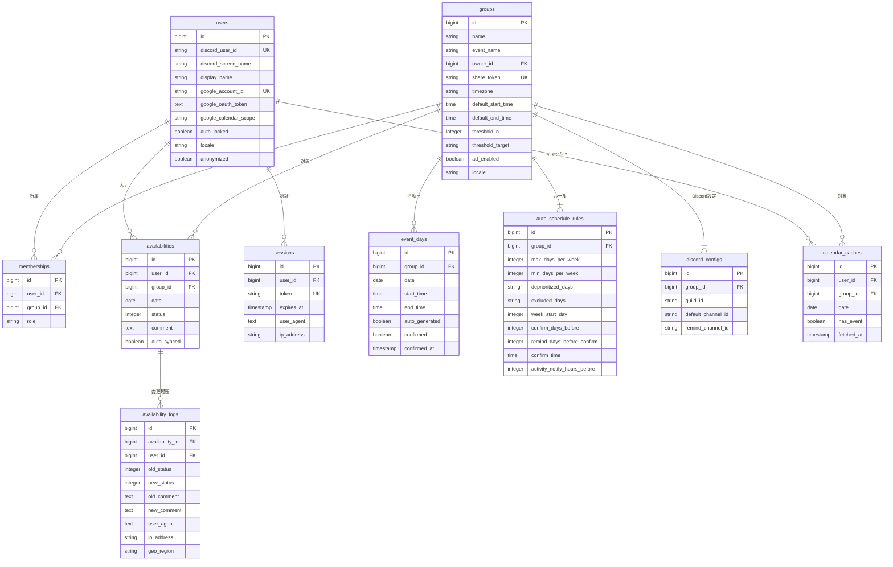

# 設計ドキュメント: スケジュール調整ツール

## 設計セクション一覧

> 各セクションの完了状態を管理するチェックリストです。設計レビュー時に進捗を確認してください。

- [x] 1. 概要・設計方針
- [x] 2. アーキテクチャ（システム構成・リクエストフロー・認証フロー）
- [x] 3. コンポーネント設計（バックエンド・フロントエンド・Discord Bot）
- [x] 4. API 設計（エンドポイント一覧・リクエスト/レスポンス例）
- [x] 5. データモデル（ER 図・主要データフロー）
- [x] 6. 正確性プロパティ（Correctness Properties）
- [x] 7. エラーハンドリング
- [x] 8. テスト戦略

---

## 1. 概要

本ドキュメントは、小規模グループ（最大約20名）向けスケジュール調整ツールの技術設計を定義する。Discord コミュニティでの利用を前提とし、メンバーの参加可否の可視化、活動日の自動・手動設定、Discord Bot および Google カレンダーとの連携を提供する。

技術スタック、データベース設計、インフラ構成の詳細は [doc/tech.md](../../doc/tech.md) を参照。本ドキュメントではアーキテクチャ、コンポーネント設計、API 設計、画面設計に焦点を当てる。

### 設計方針

- **2層認証**: ゆるい識別（localStorage）と OAuth 識別（Cookie）の2層構造で、導入障壁を最小化しつつセキュリティを確保
- **モノレポ構成**: `backend/`（Rails API）、`frontend/`（React）、`bot/`（Discord Bot）を1リポジトリで管理
- **全部載せ VPS**: ConoHa VPS 1台に Docker Compose で全コンポーネントを同居
- **プライバシー重視**: Google カレンダーの予定詳細は一切取得・保存せず、FreeBusy（予定の有無）のみ参照

---

## 2. アーキテクチャ

### 2.1 システム全体構成



### 2.2 リクエストフロー



### 2.3 認証フロー（2層構造）



---

## 3. コンポーネント設計

### 3.1 バックエンド（Rails API）コンポーネント構成

```
backend/
├── app/
│   ├── controllers/
│   │   ├── api/
│   │   │   ├── groups_controller.rb          # グループ CRUD
│   │   │   ├── memberships_controller.rb      # メンバー管理
│   │   │   ├── availabilities_controller.rb   # 参加可否入力・取得
│   │   │   ├── event_days_controller.rb       # 活動日管理
│   │   │   ├── auto_schedule_rules_controller.rb  # 自動確定ルール
│   │   │   ├── calendar_syncs_controller.rb   # Google カレンダー同期
│   │   │   ├── sessions_controller.rb         # OAuth セッション管理
│   │   │   └── settings_controller.rb         # グループ設定
│   │   └── oauth/
│   │       ├── google_controller.rb           # Google OAuth コールバック
│   │       └── discord_controller.rb          # Discord OAuth コールバック
│   ├── models/
│   │   ├── user.rb
│   │   ├── group.rb
│   │   ├── membership.rb
│   │   ├── availability.rb
│   │   ├── availability_log.rb
│   │   ├── event_day.rb
│   │   ├── auto_schedule_rule.rb
│   │   ├── session.rb
│   │   ├── calendar_cache.rb
│   │   └── discord_config.rb
│   ├── services/
│   │   ├── auto_schedule_service.rb           # 活動日自動確定ロジック
│   │   ├── freebusy_sync_service.rb           # FreeBusy 一括取得
│   │   ├── calendar_write_service.rb          # Google カレンダー書き込み
│   │   ├── availability_aggregator.rb         # 参加可否集計
│   │   └── member_anonymizer.rb               # 退会メンバー匿名化
│   ├── jobs/
│   │   ├── auto_confirm_job.rb                # 週次自動確定
│   │   ├── remind_job.rb                      # リマインド送信
│   │   ├── daily_notify_job.rb                # 活動日当日通知
│   │   └── freebusy_fetch_job.rb              # FreeBusy 取得
│   └── policies/
│       ├── group_policy.rb                    # グループ権限
│       ├── availability_policy.rb             # 参加可否権限
│       └── event_day_policy.rb                # 活動日権限
```

### 3.2 フロントエンド（React）コンポーネント構成

```
frontend/
├── src/
│   ├── pages/
│   │   ├── SchedulePage.tsx                   # メインスケジュールページ
│   │   ├── SettingsPage.tsx                   # グループ設定ページ
│   │   └── OAuthCallbackPage.tsx              # OAuth コールバック
│   ├── components/
│   │   ├── availability/
│   │   │   ├── AvailabilityBoard.tsx          # カレンダー形式の一覧表示
│   │   │   ├── AvailabilityCell.tsx           # 各セル（○△×−）
│   │   │   ├── AvailabilitySummary.tsx        # 日別集計表示
│   │   │   ├── CommentTooltip.tsx             # コメントツールチップ
│   │   │   └── MonthWeekToggle.tsx            # 月/週切り替え
│   │   ├── members/
│   │   │   ├── MemberSelector.tsx             # メンバー選択バー
│   │   │   ├── MemberAvatar.tsx               # メンバー表示（🔒付き）
│   │   │   └── MemberRoleBadge.tsx            # Core/Sub バッジ
│   │   ├── events/
│   │   │   ├── EventDayMarker.tsx             # 活動日マーカー
│   │   │   ├── EventTimeEditor.tsx            # 活動時間編集（Owner）
│   │   │   └── AutoScheduleRuleForm.tsx       # 自動確定ルール設定
│   │   ├── settings/
│   │   │   ├── GroupSettingsForm.tsx           # グループ基本設定
│   │   │   ├── ThresholdSettings.tsx          # 閾値設定
│   │   │   ├── NotificationSettings.tsx       # 通知設定
│   │   │   └── CalendarSyncSettings.tsx       # カレンダー連携設定
│   │   ├── auth/
│   │   │   ├── GoogleLoginButton.tsx          # Google ログインボタン
│   │   │   └── LockIcon.tsx                   # 🔒 アイコン
│   │   └── ads/
│   │       ├── AdBanner.tsx                   # 広告バナー
│   │       └── AdPlacement.tsx                # 広告配置制御
│   ├── hooks/
│   │   ├── useAvailabilities.ts               # 参加可否データ取得
│   │   ├── useCurrentUser.ts                  # 現在のユーザー識別
│   │   ├── useGroupSettings.ts                # グループ設定
│   │   └── useCalendarSync.ts                 # カレンダー同期
│   ├── api/
│   │   └── client.ts                          # Axios クライアント設定
│   ├── i18n/
│   │   ├── ja.json                            # 日本語リソース
│   │   └── en.json                            # 英語リソース
│   └── utils/
│       ├── availabilitySymbols.ts             # ロケール別記号マッピング
│       └── dateUtils.ts                       # 日付ユーティリティ
```

### 3.3 Discord Bot コンポーネント構成

```
bot/
├── src/
│   ├── index.ts                               # エントリポイント
│   ├── commands/
│   │   ├── schedule.ts                        # /schedule コマンド
│   │   ├── status.ts                          # /status コマンド
│   │   └── settings.ts                        # /settings コマンド
│   ├── events/
│   │   ├── guildMemberAdd.ts                  # メンバー参加イベント
│   │   ├── guildMemberRemove.ts               # メンバー退出イベント
│   │   └── ready.ts                           # Bot 起動イベント
│   ├── services/
│   │   ├── apiClient.ts                       # Rails API クライアント
│   │   ├── notifier.ts                        # 通知送信
│   │   └── reminderFormatter.ts               # リマインドメッセージ整形
│   └── setup/
│       └── initialSetup.ts                    # 初回設定フロー
```

### 3.4 コンポーネント間通信



---

## 4. API 設計

### 4.1 認証・セッション

| メソッド | パス | 説明 | 認証 |
|---|---|---|---|
| GET | `/oauth/google` | Google OAuth 開始 | 不要 |
| GET | `/oauth/google/callback` | Google OAuth コールバック | 不要 |
| GET | `/oauth/discord` | Discord OAuth 開始 | 不要 |
| GET | `/oauth/discord/callback` | Discord OAuth コールバック | 不要 |
| DELETE | `/api/sessions` | ログアウト | Cookie |

### 4.2 グループ

| メソッド | パス | 説明 | 認証 |
|---|---|---|---|
| GET | `/api/groups/:share_token` | グループ情報取得 | 不要 |
| PATCH | `/api/groups/:id` | グループ設定更新 | Owner（Cookie） |
| POST | `/api/groups/:id/regenerate_token` | 共通URL再生成 | Owner（Cookie） |

### 4.3 メンバー

| メソッド | パス | 説明 | 認証 |
|---|---|---|---|
| GET | `/api/groups/:share_token/members` | メンバー一覧取得 | 不要 |
| PATCH | `/api/memberships/:id` | メンバー役割変更 | Owner（Cookie） |
| PATCH | `/api/users/:id/display_name` | 表示名変更 | ゆるい識別 or Cookie |

### 4.4 参加可否

| メソッド | パス | 説明 | 認証 |
|---|---|---|---|
| GET | `/api/groups/:share_token/availabilities` | 全メンバーの参加可否取得（月単位） | 不要 |
| PUT | `/api/groups/:share_token/availabilities` | 参加可否の一括更新 | ゆるい識別 or Cookie |

**参加可否取得レスポンス例:**

```json
{
  "group": {
    "id": 1,
    "name": "サッカーチーム",
    "locale": "ja",
    "threshold_n": 3,
    "threshold_target": "core",
    "default_start_time": "19:00",
    "default_end_time": "22:00"
  },
  "members": [
    {
      "id": 42,
      "display_name": "えれん",
      "discord_screen_name": "eren_discord",
      "role": "core",
      "auth_locked": true
    }
  ],
  "availabilities": {
    "2025-01-06": {
      "42": { "status": 1, "comment": null, "auto_synced": false },
      "43": { "status": -1, "comment": "出張", "auto_synced": true }
    }
  },
  "event_days": {
    "2025-01-08": {
      "start_time": "19:00",
      "end_time": "22:00",
      "confirmed": true,
      "custom_time": false
    }
  },
  "summary": {
    "2025-01-06": { "ok": 5, "maybe": 2, "ng": 1, "none": 2 }
  }
}
```

**参加可否更新リクエスト例:**

```json
{
  "user_id": 42,
  "availabilities": [
    { "date": "2025-01-06", "status": 1, "comment": null },
    { "date": "2025-01-07", "status": -1, "comment": "出張のため" }
  ]
}
```

### 4.5 活動日

| メソッド | パス | 説明 | 認証 |
|---|---|---|---|
| GET | `/api/groups/:id/event_days` | 活動日一覧取得 | 不要 |
| POST | `/api/groups/:id/event_days` | 活動日手動追加 | Owner（Cookie） |
| PATCH | `/api/event_days/:id` | 活動日更新（時間変更等） | Owner（Cookie） |
| DELETE | `/api/event_days/:id` | 活動日削除 | Owner（Cookie） |

### 4.6 自動確定ルール

| メソッド | パス | 説明 | 認証 |
|---|---|---|---|
| GET | `/api/groups/:id/auto_schedule_rule` | ルール取得 | Owner（Cookie） |
| PUT | `/api/groups/:id/auto_schedule_rule` | ルール更新 | Owner（Cookie） |

### 4.7 Google カレンダー連携

| メソッド | パス | 説明 | 認証 |
|---|---|---|---|
| POST | `/api/groups/:share_token/calendar_sync` | 強制同期（今すぐ同期） | ゆるい識別 or Cookie |
| DELETE | `/api/users/:id/google_link` | Google 連携解除 | Cookie（本人 or Owner） |

### 4.8 Discord Bot → Rails API（内部 API）

| メソッド | パス | 説明 | 認証 |
|---|---|---|---|
| POST | `/api/internal/groups` | グループ初回作成 | Bot トークン |
| POST | `/api/internal/groups/:id/sync_members` | メンバー同期 | Bot トークン |
| GET | `/api/internal/groups/:id/weekly_status` | 週次入力状況 | Bot トークン |
| POST | `/api/internal/notifications/remind` | リマインド送信トリガー | Bot トークン |
| POST | `/api/internal/notifications/daily` | 当日通知トリガー | Bot トークン |

---

## 5. データモデル

データベースの詳細なテーブル定義は [doc/tech.md](../../doc/tech.md) の「データベース設計」セクションを参照。

### 5.1 ER 図



> **補足**: `auto_schedule_rules.deprioritized_days` と `excluded_days` は PostgreSQL の `integer[]` 型を使用する。ER 図では Mermaid の制約上 `string` と表記しているが、実際の型は [doc/tech.md](../../doc/tech.md) を参照。

### 5.2 主要なデータフロー

**参加可否入力フロー:**
1. ユーザーが AvailabilityCell をクリック → status を切り替え
2. React が `PUT /api/groups/:share_token/availabilities` を送信
3. Rails が `availabilities` テーブルを upsert
4. `availability_logs` に変更履歴を記録（User-Agent、IP、地域情報）
5. TanStack Query がキャッシュを無効化 → 画面再描画

**活動日自動確定フロー:**
1. sidekiq-cron が `auto_confirm_job` を確定時刻に実行
2. `AutoScheduleService` が当該週の参加可否を集計
3. ルールに基づいて活動日を決定し `event_days` に保存（`confirmed: true`）
4. Sidekiq が Discord Bot 内部 API を呼び出し → チャンネルに予定一覧投稿
5. Sidekiq が Google Calendar API を呼び出し → Owner サブカレンダー + 書き込み連携メンバーの個人カレンダーに予定作成

---

## 6. 正確性プロパティ（Correctness Properties）

*プロパティとは、システムの全ての有効な実行において成り立つべき特性や振る舞いのことである。人間が読める仕様と、機械で検証可能な正確性保証の橋渡しとなる。*

### Property 1: auth_locked ユーザーの操作拒否

*任意の* `auth_locked=true` のユーザーについて、有効なセッション Cookie なしで参加可否の変更操作を行った場合、システムは操作を拒否しなければならない。

**Validates: Requirements 1.5**

### Property 2: Google アカウント一意制約

*任意の* Google 連携済みユーザー（`google_account_id` が設定済み）について、異なる `google_account_id` での認証を試みた場合、システムは認証を拒否しなければならない。

**Validates: Requirements 1.6**

### Property 3: Google 連携解除のクリーンアップ（ラウンドトリップ）

*任意の* Google 連携済みユーザーについて、連携解除を実行した後、`auth_locked` は `false`、`google_oauth_token` は `null`、`google_account_id` は `null` となり、該当ユーザーの `calendar_caches` レコードは全て削除されなければならない。

**Validates: Requirements 1.7, 7.11**

### Property 4: 変更履歴の記録（不変条件）

*任意の* Availability の変更操作について、操作完了後に `availability_logs` テーブルに対応するレコードが作成され、`old_status`、`new_status`、`user_agent`、`ip_address`、`created_at` が記録されなければならない。

**Validates: Requirements 1.10**

### Property 5: Availability の保存ラウンドトリップ

*任意の* 有効な status 値（1, 0, -1）と任意のコメント文字列について、Availability を保存した後に取得すると、同じ status 値とコメント文字列が返されなければならない。

**Validates: Requirements 3.2, 3.4**

### Property 6: カレンダー同期による自動×設定

*任意の* `calendar_caches` で `has_event=true` の日について、対応するメンバーの Availability の status は自動的に `-1`（×）に設定され、`auto_synced=true` がマークされなければならない。

**Validates: Requirements 3.5**

### Property 7: 過去日付の権限制御

*任意の* 過去の日付について、一般メンバー（Owner でないユーザー）による Availability の変更は拒否され、Owner による変更は許可されなければならない。

**Validates: Requirements 3.7, 3.8**

### Property 8: 集計の正確性（不変条件）

*任意の* 日付とメンバー集合について、集計結果の `ok`（○の人数）+ `maybe`（△の人数）+ `ng`（×の人数）+ `none`（未入力の人数）の合計は、グループの総メンバー数と一致しなければならない。

**Validates: Requirements 4.4**

### Property 9: 閾値判定

*任意の* `threshold_n` と `threshold_target` の設定について、`threshold_target="core"` の場合は Core_Member のみの×人数、`threshold_target="all"` の場合は全メンバーの×人数を対象とし、×人数が `threshold_n` 以上の場合に警告フラグが `true` になり、未満の場合は `false` になるべきである。

**Validates: Requirements 4.7, 4.8**

### Property 10: ロケール記号切り替え

*任意の* ロケール（`ja` / `en`）と status 値（1, 0, -1, null）の組み合わせについて、記号変換関数は正しい記号を返さなければならない（ja: ○/△/×/−、en: ✓/?/✗/−）。

**Validates: Requirements 4.12**

### Property 11: 自動スケジュールルールの制約充足

*任意の* `Auto_Schedule_Rule`（最大/最低活動日数、除外曜日、優先度を下げる曜日）と参加可否データについて、自動生成された Event_Day の集合は以下を満たさなければならない:
- 週あたりの活動日数が `max_days_per_week` 以下
- 週あたりの活動日数が `min_days_per_week` 以上
- `excluded_days` に含まれる曜日は、`min_days_per_week` 未達の場合を除き活動日にならない

**Validates: Requirements 5.1**

### Property 12: 確定日計算

*任意の* `week_start_day`（0〜6）と `confirm_days_before`（正の整数）について、計算された確定日は `week_start_day` の `confirm_days_before` 日前の日付と一致しなければならない。

**Validates: Requirements 5.4**

### Property 13: Event_Day デフォルト時間適用

*任意の* Event_Day について、`start_time` または `end_time` が `null` の場合、表示時にはグループの `default_start_time` / `default_end_time` が使用されなければならない。

**Validates: Requirements 5.9**

### Property 14: プライバシー制約（calendar_caches）

*任意の* カレンダー同期操作後、`calendar_caches` テーブルに保存されるデータは `has_event`（boolean）のみであり、予定のタイトル、詳細、参加者等の情報は一切保存されてはならない。

**Validates: Requirements 7.3, 10.1**

### Property 15: キャッシュ有効期限判定

*任意の* `calendar_caches` レコードについて、`fetched_at` から現在時刻までの経過時間が15分以上の場合はキャッシュ無効（再取得が必要）、15分未満の場合はキャッシュ有効と判定されなければならない。

**Validates: Requirements 7.4**

### Property 16: グループ間のコメント非公開

*任意の* グループ A のメンバーのコメントについて、グループ B（A ≠ B）のメンバーが API 経由でアクセスした場合、コメントは返されてはならない。

**Validates: Requirements 10.3**

### Property 17: 退会メンバーの匿名化・可視性制御

*任意の* 退会処理されたメンバーについて、以下が全て成り立たなければならない:
- `anonymized=true` である
- `display_name` が匿名化されている（「退会済みメンバーX」形式）
- `google_oauth_token` と `discord_user_id` が `null` である
- `availabilities` レコードは削除されず保持されている
- 一般メンバーからは退会メンバーのデータが非表示である
- Owner からは退会メンバーのデータが閲覧可能である

**Validates: Requirements 10.4, 10.5, 10.6**

---

## 7. エラーハンドリング

### 7.1 API エラーレスポンス形式

全ての API エラーは統一された JSON 形式で返す:

```json
{
  "error": {
    "code": "VALIDATION_ERROR",
    "message": "参加可否のステータスが不正です",
    "details": [
      { "field": "status", "message": "1, 0, -1 のいずれかを指定してください" }
    ]
  }
}
```

### 7.2 HTTP ステータスコード

| ステータス | 用途 |
|---|---|
| 200 | 正常レスポンス |
| 201 | リソース作成成功 |
| 400 | バリデーションエラー（不正なパラメータ） |
| 401 | 認証エラー（Cookie 無効、セッション期限切れ） |
| 403 | 権限エラー（Owner 権限が必要な操作を一般メンバーが実行） |
| 404 | リソース未検出（不正な share_token 等） |
| 409 | 競合エラー（Google アカウントの重複紐付け等） |
| 422 | 処理不能（メンバー上限到達等） |
| 429 | レート制限超過 |
| 500 | サーバー内部エラー |
| 502 | 外部サービス接続エラー（Google API、Discord API） |

### 7.3 外部サービスエラー

| サービス | エラー種別 | 対応 |
|---|---|---|
| Google Calendar API | 認証トークン期限切れ | リフレッシュトークンで再取得。失敗時はユーザーに再認証を促す |
| Google Calendar API | API レート制限 | 指数バックオフでリトライ（最大3回） |
| Google Calendar API | 接続タイムアウト | エラーメッセージを表示し手動入力を促す |
| Discord API | WebSocket 切断 | 自動再接続（discord.js の組み込み機能） |
| Discord API | DM 送信失敗 | DM 無効ユーザーとしてログに記録。チャンネル通知にフォールバック |
| Discord API | レート制限 | discord.js の組み込みレート制限ハンドラーに委任 |

### 7.4 バックグラウンドジョブエラー

| ジョブ | エラー対応 |
|---|---|
| auto_confirm_job | 失敗時は Sidekiq のリトライ機構で最大3回再試行。全て失敗した場合は Owner に Discord 通知 |
| remind_job | DM 送信失敗はスキップしてログ記録。チャンネル通知は必ず実行 |
| freebusy_fetch_job | API エラー時はキャッシュを更新せず、既存キャッシュを継続使用 |
| daily_notify_job | 失敗時はリトライ。通知チャンネルが無効な場合はデフォルトチャンネルにフォールバック |

### 7.5 フロントエンドエラー

| エラー種別 | 対応 |
|---|---|
| API 通信エラー | TanStack Query のリトライ機構（3回）。失敗時はトースト通知でエラーメッセージ表示 |
| セッション期限切れ | 401 レスポンス受信時に「再ログイン」ボタンを表示 |
| localStorage 利用不可 | シークレットモードの場合はインメモリで代替。ユーザーに注意メッセージ表示 |
| ネットワークオフライン | オフライン検知時に「接続を確認してください」バナー表示 |

---

## 8. テスト戦略

### 8.1 テストの全体方針

**デュアルテストアプローチ**を採用する:
- **ユニットテスト**: 具体的な例、エッジケース、エラー条件の検証
- **プロパティテスト**: 全入力に対して成り立つべき普遍的なプロパティの検証

両者は補完的であり、包括的なカバレッジのために両方が必要。

### 8.2 バックエンド（Ruby on Rails）

| テスト種別 | ツール | 対象 |
|---|---|---|
| ユニットテスト | RSpec | モデル、サービス、ポリシー |
| プロパティテスト | rspec-property（Rantly） | コアロジック（集計、ルール判定、権限制御） |
| リクエストテスト | RSpec + rack-test | API エンドポイント |
| 統合テスト | RSpec | ジョブ、外部サービス連携（モック使用） |

**プロパティテスト設定:**
- 各プロパティテストは最低100回のイテレーションを実行
- 各テストにはコメントで設計ドキュメントのプロパティ番号を参照
- タグ形式: `# Feature: schedule-management-tool, Property {番号}: {プロパティ名}`

**プロパティテスト対象（バックエンド）:**
- Property 1: auth_locked ユーザーの操作拒否
- Property 2: Google アカウント一意制約
- Property 3: Google 連携解除のクリーンアップ
- Property 4: 変更履歴の記録
- Property 5: Availability の保存ラウンドトリップ
- Property 6: カレンダー同期による自動×設定
- Property 7: 過去日付の権限制御
- Property 8: 集計の正確性
- Property 9: 閾値判定
- Property 11: 自動スケジュールルールの制約充足
- Property 12: 確定日計算
- Property 13: Event_Day デフォルト時間適用
- Property 15: キャッシュ有効期限判定
- Property 16: グループ間のコメント非公開
- Property 17: 退会メンバーの匿名化・可視性制御

### 8.3 フロントエンド（React）

| テスト種別 | ツール | 対象 |
|---|---|---|
| ユニットテスト | Vitest + React Testing Library | コンポーネント、hooks、ユーティリティ |
| プロパティテスト | fast-check | ロケール記号変換、日付ユーティリティ |
| E2E テスト | Playwright | 主要ユーザーフロー |

**プロパティテスト対象（フロントエンド）:**
- Property 10: ロケール記号切り替え

### 8.4 Discord Bot（Node.js）

| テスト種別 | ツール | 対象 |
|---|---|---|
| ユニットテスト | Jest | コマンドハンドラー、メッセージ整形 |
| 統合テスト | Jest + モック | Rails API クライアント、通知送信 |

### 8.5 テストカバレッジ目標

| 対象 | カバレッジ目標 |
|---|---|
| バックエンドモデル・サービス | 90% 以上 |
| API エンドポイント | 85% 以上 |
| フロントエンドユーティリティ | 90% 以上 |
| フロントエンドコンポーネント | 70% 以上 |
| Discord Bot | 80% 以上 |

### 8.6 CI パイプラインでのテスト実行

```
GitHub Actions:
  ├── backend/
  │   ├── RSpec（ユニット + プロパティ + リクエスト）
  │   ├── RuboCop（Lint）
  │   └── Brakeman（セキュリティスキャン）
  ├── frontend/
  │   ├── Vitest（ユニット + プロパティ）
  │   ├── ESLint + Prettier
  │   └── TypeScript 型チェック
  └── bot/
      ├── Jest（ユニット + 統合）
      └── ESLint
```
